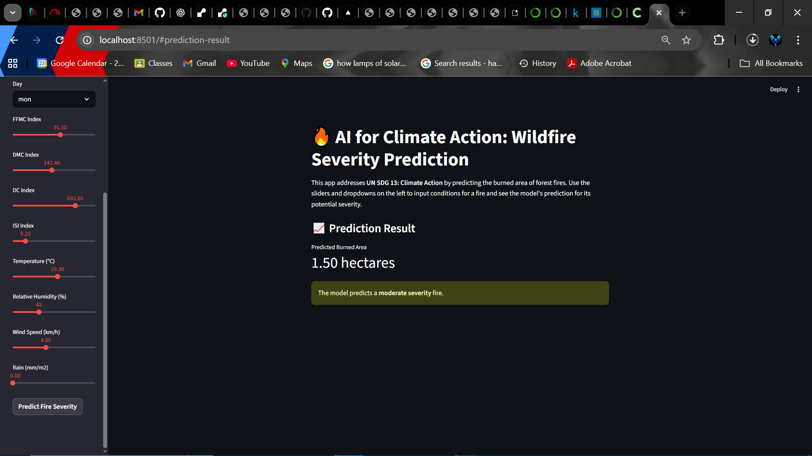
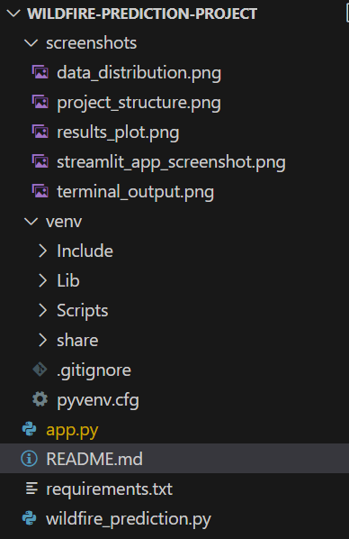
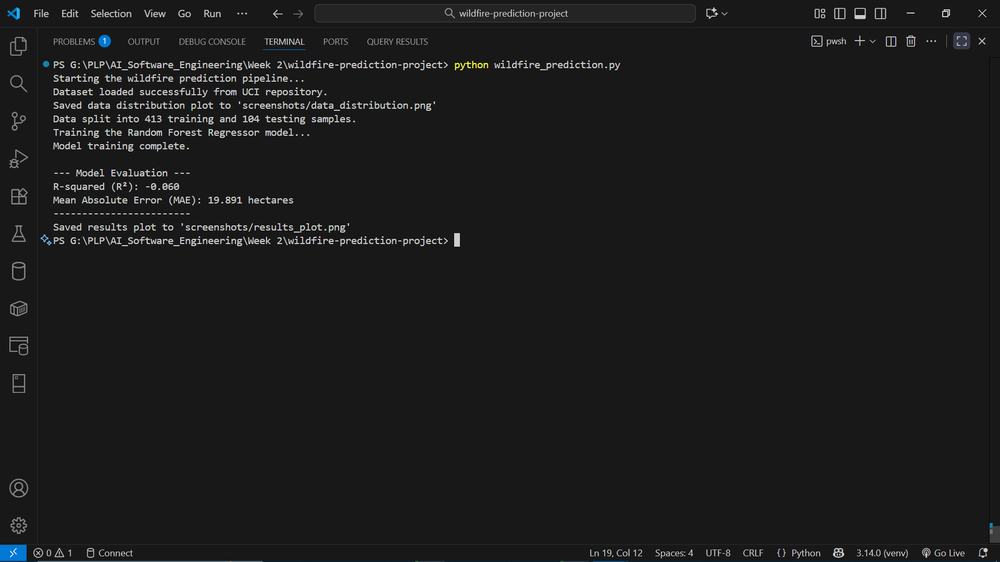
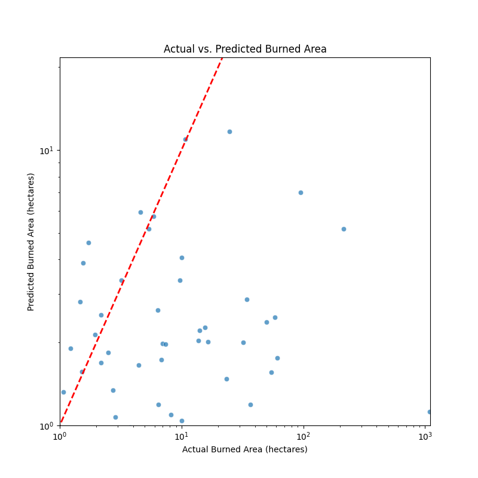

# 🔥 AI for Climate Action: Wildfire Severity Predictor

[](https://www.python.org/downloads/)
[](requirements.txt)
[](https://sdgs.un.org/goals/goal13)

> “AI can be the bridge between innovation and sustainability.” — UN Tech Envoy

This project brings that quote to life by addressing **UN Sustainable Development Goal 13: Climate Action**. It leverages machine learning to predict the severity of forest fires based on meteorological data, providing a crucial tool for proactive resource management and climate change mitigation.

---

## 🚀 Interactive Web App Demo

I have deployed this model as an interactive web application using **Streamlit**. You can input various fire and weather conditions and instantly get a prediction for the potential burned area.



---

## 🌳 The Problem: A World on Fire

Climate change is escalating the frequency and intensity of wildfires, which pose a severe threat to ecosystems, human lives, and the global climate. They release massive amounts of CO₂ into the atmosphere, creating a destructive feedback loop.

The core challenge for firefighting agencies is **resource allocation**. Without knowing a fire's potential severity, it's difficult to decide where to deploy limited personnel and equipment for maximum impact. This project tackles that challenge head-on.

---

## 💡 The Solution: A Predictive AI Model

I developed a supervised machine learning model that acts as a data-driven early warning system.

**How it works:**
1.  **Input**: The model takes in meteorological and geographical data (temperature, humidity, wind, location, etc.).
2.  **ML Model**: A **Random Forest Regressor** learns the complex patterns between these inputs and the final burned area from historical fire data.
3.  **Output**: It predicts the total burned area in hectares, giving decision-makers a quantifiable estimate of the fire's potential severity.

---

## 🛠️ Technologies & Tools

This project was built using a robust stack of open-source tools:

-   **Python**: The core programming language.
-   **Pandas**: For efficient data manipulation and analysis.
-   **Scikit-learn**: For building and training the Random Forest model.
-   **Streamlit**: To create and deploy the interactive web application.
-   **Matplotlib & Seaborn**: For generating insightful data visualizations.

---

## 📂 Project Structure

The repository is organized to be clean and reproducible.



```
wildfire-prediction-project/
├── screenshots/
│   ├── data_distribution.png
│   ├── results_plot.png
│   ├── terminal_output.png
│   └── streamlit_app_screenshot.png
├── .gitignore
├── app.py                  # Streamlit Web App
├── wildfire_prediction.py  # Core ML Model Script
├── requirements.txt        # Project dependencies
└── README.md               # You are here!
```

---

## 📈 Model Performance & Results

The model was trained and evaluated on the UCI Forest Fires dataset. Here's a summary of its performance.

**1. Terminal Output After Running the Script:**
*This shows the final evaluation metrics.*


**2. Actual vs. Predicted Burned Area:**
*This plot visualizes the model's predictions against the true values. A perfect model would have all points on the red dashed line.*


The evaluation shows that predicting wildfire severity is a highly complex task. The model's performance, while modest, demonstrates a functional pipeline and provides a strong baseline for future improvements with more extensive data.

---

## 🚀 Getting Started Locally

To run this project, you can use either Conda (recommended for avoiding installation issues) or a standard Python virtual environment.

### Method 1: Using Conda (Recommended)

Conda is a package manager that handles complex dependencies (like the ones that caused build errors) automatically. This is the most reliable way to set up the project.

**1. Install Conda:**
If you don't have it, install [Miniconda](https://docs.conda.io/en/latest/miniconda.html) (a lightweight version of Anaconda).

**2. Create and activate the environment:**
Open the Anaconda Prompt (or your terminal) and run:
```bash
# Create a new environment named 'wildfire_env' with Python 3.11
conda create --name wildfire_env python=3.11 -y

# Activate the environment
conda activate wildfire_env
```

**3. Install dependencies from conda-forge:**
The `conda-forge` channel provides the most up-to-date and reliable packages.
```bash
conda install -c conda-forge streamlit pandas scikit-learn matplotlib seaborn -y
```

**4. Run the Streamlit Web App:**
```bash
streamlit run app.py
```

### Method 2: Using Pip and Venv (Alternative)

If you prefer not to use Conda, you can use a standard Python virtual environment.

**1. Clone the repository and navigate into it.**

**2. Create and activate a virtual environment:**
```bash
# Create the environment
python -m venv venv

# Activate it (on Windows Git Bash or Linux/macOS)
source venv/bin/activate
# On Windows Command Prompt: venv\Scripts\activate
```

**3. Install the dependencies from requirements.txt:**
```bash
pip install -r requirements.txt
```
*Note: This may lead to build errors on some systems for packages like `pyarrow`. If you encounter issues, the Conda method is recommended.*

**4. Run the Streamlit Web App:**
```bash
streamlit run app.py
```
##  Reflections & Ethical Considerations

Building AI for good requires careful thought about its limitations and societal impact.

-   🌍 **Geographical Bias**: The model is trained *only* on data from Portugal. It is **not** a universal model and would perform poorly in other regions like California or Australia without being retrained on local data.
-   ⏳ **Temporal Bias**: Climate change is altering weather patterns. A model trained on historical data may become less accurate over time and requires continuous monitoring and retraining.
-   🤝 **Promoting Fairness**: By providing objective, data-driven insights, this tool can help ensure that firefighting resources are distributed based on risk, not on the wealth or political influence of a region, promoting equitable protection for all communities.

This project is a tangible example of how AI can be a powerful ally in our global fight against climate change.